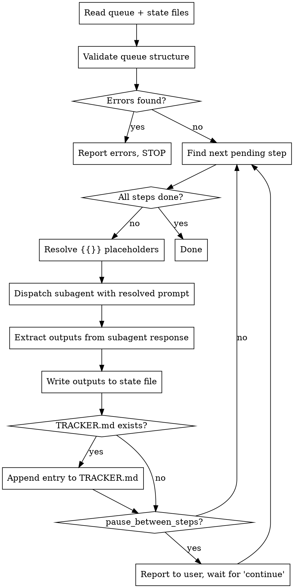

# Prompt Queue Orchestrator

Execute a sequence of user-written prompts from `docs/prompt_queue.md`, dispatching a fresh subagent per step. Outputs from earlier steps (file paths, decisions, names) are captured and injected into later steps via `{{step_N.variable}}` placeholders.

## Files

| File | Purpose | Who writes it |
|------|---------|---------------|
| `docs/prompt_queue.md` | The prompts + output declarations | User |
| `docs/prompt_queue_state.md` | Runtime state (current step, resolved vars) | Agent (auto) |

## Queue File Format

```markdown
# Prompt Queue

## Config
pause_between_steps: false

## Step 1: Short Title
### Prompt
Your instructions here.

### Outputs
- plan_file: path to the plan file created
- decision: which approach was chosen

---

## Step 2: Next Title
### Prompt
Execute the plan at {{step_1.plan_file}}.

### Outputs
(none)
```

**Rules:**
- Steps numbered sequentially starting at 1
- `### Outputs` lists key-value names the subagent must report
- `(none)` or empty means no outputs to capture
- `{{step_N.key}}` resolved from state file before dispatch
- `---` separates steps

## State File Format (auto-managed)

```markdown
# Prompt Queue State

## Current Step: 2
## Status: in_progress

## Completed Steps

### Step 1: Short Title
- status: completed
- plan_file: docs/plans/2026-02-19-db-consolidation.md
- decision: approach_b
```

## Orchestration Process



### Step-by-step

1. **Read** `docs/prompt_queue.md` and `docs/prompt_queue_state.md` (create state file if missing)
2. **Validate queue structure** — scan the entire queue file and check:
   - Has a `## Config` section
   - Every `## Step N:` has a `### Prompt` section with non-empty content
   - Every `## Step N:` has a `### Outputs` section (`(none)` is valid)
   - Step numbers are sequential starting at 1 (no gaps, no duplicates)
   - Every `{{step_N.key}}` placeholder references a step number that exists *before* the current step
   - Every `{{step_N.key}}` placeholder references a key declared in that step's `### Outputs`
   - No forward references (step 2 cannot reference step 3's output)
   - If any errors are found, list them all and STOP — do not dispatch any subagents
3. **Find next pending step** — first step not marked completed in state
4. **Resolve placeholders** — replace `{{step_N.key}}` with values from state file. If any placeholder cannot be resolved, STOP and report the missing variable
5. **Build subagent prompt** — combine:
   - The resolved prompt text
   - Project context: "Working directory: [cwd]. Virtual env: .venv."
   - Output instruction: "When finished, report these output variables on separate lines as `OUTPUT key = value`:\n- [list from ### Outputs]"
   - If `### Outputs` says `(none)`: "No output variables needed. Just confirm completion."
6. **Dispatch** via `Task` tool (subagent_type: `generalPurpose`)
7. **Parse subagent response** — extract `OUTPUT key = value` lines
8. **Update state file** — mark step completed, write resolved output variables
9. **If `docs/TRACKER.md` exists** — append entry for completed step
10. **Check pause** — if `pause_between_steps: true`, report progress to user and wait
11. **Loop** to step 3

### Resume Protocol

When user says "resume prompt queue":
1. Read state file — it has the last completed step and all resolved variables
2. Pick up from the next uncompleted step
3. No context from previous session needed beyond what's in the files

### Reset Protocol

When user says "reset prompt queue" or "reset queue prompt":
1. **Reset state file** — overwrite `docs/prompt_queue_state.md` with:
   ```markdown
   # Prompt Queue State

   ## Current Step: 0
   ## Status: not_started

   ## Completed Steps

   (none yet)
   ```
2. **Reset queue file** — overwrite `docs/prompt_queue.md` with the template at `templates/prompt_queue.md`. If the template doesn't exist in the project, use this default:
   ```markdown
   # Prompt Queue

   ## Config
   pause_between_steps: false

   ## Step 1: [Short descriptive title]

   ### Prompt
   [Your instructions here.]

   ### Outputs
   - [key]: [description]

   ---
   ```
3. **Confirm** — report both files were reset

### Error Handling

- **Validation errors:** List all structural problems found in the queue file and STOP before dispatching any subagents
- **Subagent fails:** Mark step as `failed` in state file, STOP, report error to user
- **Unresolvable placeholder:** STOP before dispatch, list which `{{step_N.key}}` is missing
- **Subagent doesn't report outputs:** Ask user whether to retry or manually provide the values

## Subagent Prompt Template

```
You are executing Step {N} of a prompt queue.

## Context
- Working directory: {cwd}
- Virtual environment: .venv (activate before running commands)
- Project tracker: docs/TRACKER.md (update after completing work, if it exists)

## Your Task
{resolved_prompt_text}

## Output Variables
When you are completely finished, report these values on separate lines:
{for each output_key: "OUTPUT {key} = <the actual value>"}

Example:
OUTPUT plan_file = docs/plans/2026-02-19-feature-x.md
OUTPUT decision = approach_b
```

## Common Mistakes

| Mistake | Fix |
|---------|-----|
| Forgetting to resolve placeholders before dispatch | Always scan for `{{` before building subagent prompt |
| Not creating state file on first run | Create it with `Current Step: 1` and `Status: pending` |
| Dispatching next step before writing state | Always write state THEN check pause THEN loop |
| Subagent edits queue file | Queue file is read-only for subagents; only state file gets written |
| Skipping TRACKER.md update when it exists | If the project has docs/TRACKER.md, update it after every step |
